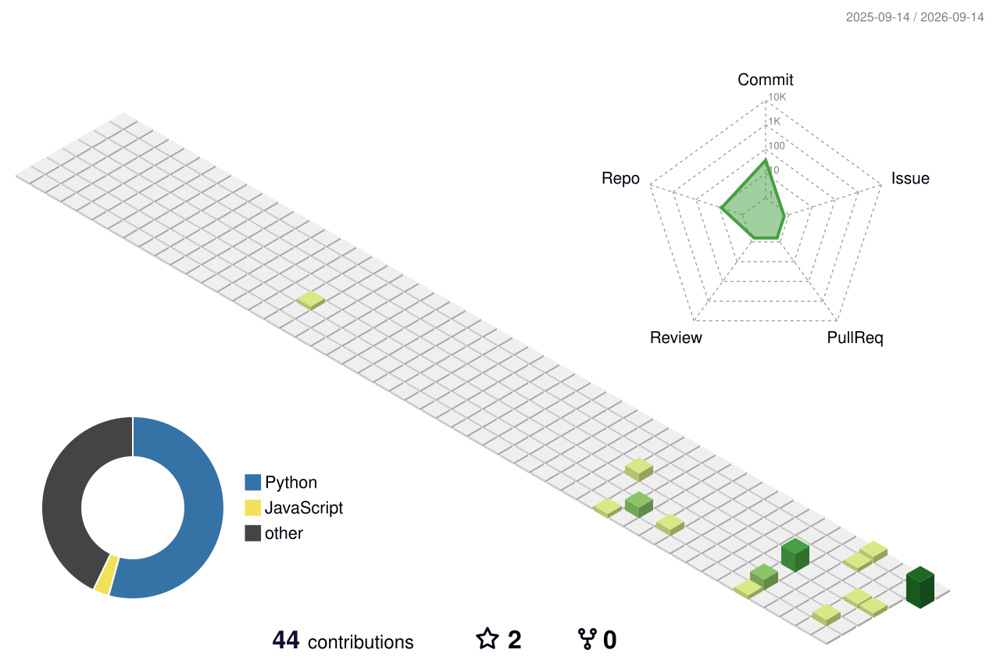

# 沐山雨薇

**南京大学 · 智能科学与技术**

AI  · 深度学习 · 世界模型 · 软件开发 · agent开发

BUILD WORLD IN CODING

[个人网站 · 文章与 Plog](https://wang-hao-journal.schnitzlermandy85.chatgpt.site) · [关于我](#关于我) · [精选项目](#精选项目) · [实验与证据](#实验与证据) · [技术方向](#技术方向) · [学习记录](#学习记录)

---

## 关于我

你好，我是沐山雨薇，来自南京大学智能科学与技术专业。

## 精选项目

<table>
<tr>
<td width="50%" valign="top">
<h3>01 · Course-Grounded Tutor</h3>

<strong>先诊断知识缺口，再推进下一步学习。</strong>

面向大学 STEM 与 AI/CS 的导师 Skill，结合课程资料、小步教学、理解检查和可复制的学习状态卡组织自学。

<code>Agent Skill</code> <code>Python</code> <code>Education</code>

<a href="https://github.com/schnitzlermandy85-beep/course-grounded-tutor">查看项目 →</a> · <a href="https://github.com/schnitzlermandy85-beep/course-grounded-tutor/tree/main/examples">教学示例</a>

</td>
<td width="50%" valign="top">
<h3>02 · Finance Desk</h3>

<strong>从数据查询到本地模拟实验的桌面工作台。</strong>

整合行情、财报与图表，提供人工账户、均线策略回测与历史练习；通过 Electron 主进程管理凭据与接口调用。

<code>Electron</code> <code>JavaScript</code> <code>Data Visualization</code>

<a href="https://github.com/schnitzlermandy85-beep/finance-desk">查看项目 →</a> · <a href="https://github.com/schnitzlermandy85-beep/finance-desk/blob/main/docs/ARCHITECTURE.md">架构设计</a>

</td>
</tr>
<tr>
<td width="50%" valign="top">
<h3>03 · Neural-Guided Visual Reasoning</h3>

<strong>用神经网络引导搜索，用程序执行验证答案。</strong>

CNN 预测下一步 DSL 操作，Beam Search 组合候选程序，解释器做精确验证。包含多 seed 评估、消融与 ARC 迁移分析。

<code>PyTorch</code> <code>Program Synthesis</code> <code>Beam Search</code>

<a href="https://github.com/schnitzlermandy85-beep/Neural-Guided-Compositional-Program-Synthesis-for-Abstract-Visual-Reasoning">查看项目 →</a> · <a href="https://github.com/schnitzlermandy85-beep/Neural-Guided-Compositional-Program-Synthesis-for-Abstract-Visual-Reasoning/blob/main/PAPER_DRAFT_EN.md">研究草稿</a>

</td>
<td width="50%" valign="top">
<h3>04 · CIFAR Optimizer Lab</h3>

<strong>从参数更新出发理解优化器的差异。</strong>

在 CIFAR-10 / CIFAR-100 上对比手写 SGD、AdamW 与 Muon-AdamW，记录训练曲线、跨 seed 统计、时间与显存。

<code>PyTorch</code> <code>Optimization</code> <code>CIFAR</code>

<a href="https://github.com/schnitzlermandy85-beep/CNN-of-Matrix-Optimization-Algorithm">查看项目 →</a> · <a href="https://github.com/schnitzlermandy85-beep/CNN-of-Matrix-Optimization-Algorithm/blob/main/cifar_muon_compare.py">核心实现</a>

</td>
</tr>
</table>

## 实验与证据

在神经引导视觉推理项目中，我关注搜索效率与解题能力之间的取舍。仓库中的合成任务五 seed 结果为：

| 方法 | 平均解题率 | 平均扩展节点 |
| :--- | ---: | ---: |
| Greedy generation | 26.96% | 2.36 |
| **Neural Beam Search** | **69.04%** | **6.74** |
| Exhaustive Search | 100.00% | 52.34 |

Neural Beam 的平均扩展节点较穷举减少约 **87.1%**，同时解题率低于穷举。以上结果限定于当前合成任务、DSL 与搜索设置，不代表通用 ARC 解题能力。

[查看原始汇总 CSV](https://github.com/schnitzlermandy85-beep/Neural-Guided-Compositional-Program-Synthesis-for-Abstract-Visual-Reasoning/blob/main/runs/v2_aggregate/method_comparison_aggregate.csv) · [查看实验设计与局限](https://github.com/schnitzlermandy85-beep/Neural-Guided-Compositional-Program-Synthesis-for-Abstract-Visual-Reasoning#5-正式实验结果)

## 技术方向

| 方向 | 项目中使用的技术与方法 |
| :--- | :--- |
| 深度学习与实验 | Python · PyTorch · NumPy · Matplotlib · 多 seed 评估 |
| 神经符号推理 | CNN · DSL · Beam Search · 精确执行验证 |
| 应用工程 | JavaScript · Electron · Node.js · API 集成 |
| AI 学习工具 | Agent Skills · 课程资料提取 · 诊断式教学 · 状态卡 |
| 文档与表达 | Markdown · 技术笔记 · 架构图 · 实验报告 |

## 3D Contribution Calendar

<picture>
  <source media="(prefers-color-scheme: dark)" srcset="./profile-3d-contrib/profile-night-green.svg" />
  
</picture>

使用 [github-profile-3d-contrib](https://github.com/yoshi389111/github-profile-3d-contrib) 原版渲染，自动适配深浅背景。数据快照：2026-09-14。

## 学习记录

### [CS231n 中文学习笔记](https://github.com/schnitzlermandy85-beep/cs231n-notes)

从图像分类、反向传播与优化，走到 CNN、RNN、Attention 和 Transformer；配合 NumPy 两层神经网络实践，将理论串成可回看的学习路线。

[笔记目录](https://github.com/schnitzlermandy85-beep/cs231n-notes#笔记目录) · [Attention 与 Transformer](https://github.com/schnitzlermandy85-beep/cs231n-notes/blob/main/Attention%20与%20Transformer.md) · [NumPy 代码实践](https://github.com/schnitzlermandy85-beep/cs231n-notes/blob/main/必会代码部分.md)

其他课程实践

[提示词工程课程作业](https://github.com/schnitzlermandy85-beep/Introduction-to-Artificial-Intelligence-Prompt-Engineering)：目前为项目说明，具体案例与实验报告待补充。

---

**Learn with curiosity. Build with evidence.**

欢迎通过对应项目的 Issues 交流使用反馈、实现细节与改进建议。

[邮件联系](mailto:schnitzlermandy85@gmail.com) · [浏览公开仓库](https://github.com/schnitzlermandy85-beep?tab=repositories&type=public)

